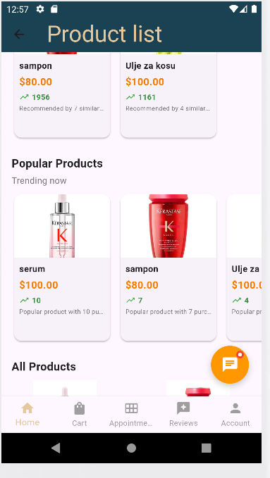
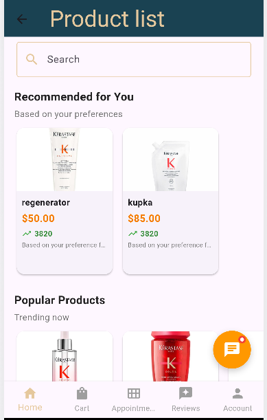

# Recommender dokumentacija

Sistem preporuka je izgrađen korištenjem hibridnog pristupa koji kombinuje više strategija preporuka:

- Kolaborativno filtriranje (na osnovu korisnika)
- Filtriranje na osnovu sadržaja (preferencije kategorije/brenda)
- Preporuke zasnovane na popularnosti
- Analiza ponašanja korisnika

## Osnovne Komponente

### 1. Modeli Podataka (RecommendationModels.cs)

```csharp
// Main recommendation output
public class ProductRecommendation
{
    public int ProductId { get; set; }
    public string ProductName { get; set; }
    public double RecommendationScore { get; set; }
    public string Reason { get; set; }
    public List<string> SimilarUsers { get; set; }
    // ... other product details
}

// User similarity tracking
public class UserSimilarity
{
    public int UserId { get; set; }
    public int SimilarUserId { get; set; }
    public double SimilarityScore { get; set; }
    public DateTime CalculatedDate { get; set; }
}

// User behavior analysis
public class UserBehavior
{
    public int PurchaseCount { get; set; }
    public decimal TotalSpent { get; set; }
    public double AverageRating { get; set; }
    public int ReviewCount { get; set; }
    // ... other behavioral metrics
}
```

### 2. Servisni Sloj (RecommendationService.cs)

Servis implementira osnovne algoritme za preporuke:

#### Kolaborativno filtriranje (na osnovu korisnika)

```csharp
public async Task<List<ProductRecommendation>> GetProductRecommendations(RecommendationRequest request)
{
    // 1. Get user's purchase history
    var userPurchases = await _context.OrderItems
        .Where(oi => oi.Order.UserId == request.UserId)
        .Include(oi => oi.Product)
        .ToListAsync();

    // 2. Find similar users based on purchase patterns
    var similarUsers = await FindSimilarUsers(request.UserId, 20);

    // 3. Get products purchased by similar users
    var similarUserPurchases = await _context.OrderItems
        .Where(oi => similarUsers.Select(su => su.SimilarUserId).Contains(oi.Order.UserId))
        .Include(oi => oi.Product)
        .ToListAsync();

    // 4. Calculate recommendation scores
    var score = similarity.SimilarityScore * purchase.Quantity * purchase.Price;
}
```

#### Izračun sličnosti (Kosinusna sličnost)

```csharp
private double CalculateCosineSimilarity(List<OrderItems> user1Purchases, List<OrderItems> user2Purchases)
{
    // Create user preference vectors
    var user1Vector = new Dictionary<int, double>();
    var user2Vector = new Dictionary<int, double>();

    // Calculate dot product and norms
    double dotProduct = 0;
    double norm1 = 0;
    double norm2 = 0;

    foreach (var productId in allProductIds)
    {
        var val1 = user1Vector[productId];
        var val2 = user2Vector[productId];
        dotProduct += val1 * val2;
        norm1 += val1 * val1;
        norm2 += val2 * val2;
    }

    return dotProduct / (Math.Sqrt(norm1) * Math.Sqrt(norm2));
}
```

#### Filtriranje na osnovu sadržaja

```csharp
public async Task<List<ProductRecommendation>> GetCategoryBasedRecommendations(int userId, int numberOfProducts = 10)
{
    // 1. Analyze user's category preferences based on spending
    var userCategoryPreferences = await _context.OrderItems
        .Where(oi => oi.Order.UserId == userId)
        .Join(_context.Products, oi => oi.ProductId, p => p.Id,
              (oi, p) => new { TotalAmount = oi.Quantity * oi.Price, p.CategoryId })
        .GroupBy(x => x.CategoryId)
        .Select(g => new { CategoryId = g.Key, TotalSpent = g.Sum(x => x.TotalAmount) })
        .OrderByDescending(x => x.TotalSpent)
        .Take(3)
        .ToListAsync();

    // 2. Recommend products from preferred categories
    var recommendations = await _context.Products
        .Where(p => preferredCategoryIds.Contains(p.CategoryId) &&
                    !userPurchasedProductIds.Contains(p.Id))
        .Take(numberOfProducts)
        .ToListAsync();
}
```

#### Preporuke zasnovane na popularnosti

```csharp
public async Task<List<ProductRecommendation>> GetPopularProducts(int numberOfProducts = 10)
{
    var popularProducts = await _context.OrderItems
        .Include(oi => oi.Product)
        .GroupBy(oi => oi.ProductId)
        .Select(g => new
        {
            ProductId = g.Key,
            TotalPurchases = g.Count(),
            TotalRevenue = g.Sum(p => p.Quantity * p.Price),
            Product = g.First().Product
        })
        .OrderByDescending(p => p.TotalPurchases)
        .ThenByDescending(p => p.TotalRevenue)
        .Take(numberOfProducts)
        .ToListAsync();
}
```

#### Preporuke za novog korisnika

```csharp
public async Task<List<ProductRecommendation>> GetRecommendationsForNewUser(int numberOfProducts = 10)
{
    // Combine popular products with highly-rated services
    var popularProducts = await GetPopularProducts(numberOfProducts / 2);

    var highlyRatedProducts = await _context.Reviews
        .Where(r => r.Rate.HasValue && r.Rate >= 4)
        .Join(_context.Appointments, r => r.AppointmentId, a => a.AppointmentId,
              (r, a) => new { r.Rate, a.ServiceId })
        .GroupBy(x => x.ServiceId)
        .Where(x => x.Count() >= 3) // Minimum 3 reviews
        .OrderByDescending(x => x.Average(x => x.Rate ?? 0))
        .Take(numberOfProducts / 2)
        .ToListAsync();
}
```

**Link za kod:**
https://github.com/amilaheric/eHairdressers/blob/main/eHairdressers/eHairdressers.Services/RecommendationService.cs

## Dinamički Sistem Ocjenjivanja

- Ocjenjivanje na osnovu kupovine: sličnost × količina × cijena
- Težinski faktor preferencija kategorije: bazirano na ukupnoj potrošnji po kategoriji
- Integracija recenzija: uzima u obzir ocjene korisnika i broj recenzija

## Keširanje i Performanse

```csharp
private readonly Dictionary<int, Dictionary<int, double>> _userSimilarityCache;
private readonly Dictionary<int, Dictionary<int, double>> _userPreferences;
```

## Strategije Rezervnog Rješenja

- Novi korisnici: popularni proizvodi + usluge s visokim ocjenama
- Nema sličnih korisnika: preporuke bazirane na kategoriji + popularnosti
- Cold start: globalni metrički podaci o popularnosti

## Izvori Podataka

Sistem koristi više izvora podataka:

- Historija narudžbi (OrderItems tabela)
- Informacije o proizvodima (Products, Category, Brand)
- Korisničke recenzije (Reviews tabela)
- Podaci o terminima (Appointments tabela)
- Ponašanje korisnika (učestalost kupovine, obrasci potrošnje)

### Screenshot u mobilnoj aplikaciji




